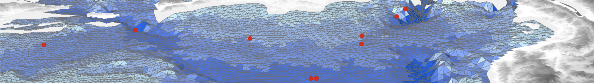

# FV-AED 
[](https://github.com/AquaticEcoDynamics/fv-aed/releases)
[](https://svgshare.com/i/Zhy.svg)
[](https://svgshare.com/i/ZhY.svg)
[](http://perso.crans.org/besson/LICENSE.html)

<br>

<a href="url"></a> FV-AED is the water quality model [AED](https://aquaticecodynamics.github.io/aed-science/index.html) ready for linking with the 3D finite volume hydrodynamic model TUFLOW-FV. 

<br>

## Repository organisation

The repository includes:

- `binaries` : model pre-compiled executables for mac, linux and windows.
- `fv-source` : model source code, including GLM and AED as linked sub-modules.
- `fv-examples` : model example simulations, including all required input files.
- `workflows` : github workflows for automated compilation and testing.

<br>

## Citing this code

[](https://doi.org/10.5281/zenodo.6363500) (BADGE PENDING RELEASE)

Pending Authors (Pending year). FV - Aquatic Ecosystem Dynamics (FV-AED) V XXXX. [Software]. Zenodo. (Pending Zenado DOI)

<br>

## Getting the latest pre-compiled version

For users who only need access to a model executable plugin, the executable for your chosen platform can be downloaded without getting the full repository. Simply navigate to the binaries/os folder, click on the relevant file (e.g., `tuflow_external_wq_2.2.1.zip`) and click the "*download*" button on the right.

<br>

## Cloning the repo with all sub-module code

To access the full repository, including the model examples, the repository must be cloned or downloaded in full. Note that a basic clone will not include the code/files in the linked sub-modules, so an extra argument is needed `--recurse-submodules`

### Cloning the latest code
```
git clone --recurse-submodules https://github.com/AquaticEcoDynamics/glm-aed.git
```

### Cloning a particular tag
```
git clone --recurse-submodules -b v3.3.0 https://github.com/AquaticEcoDynamics/glm-aed.git
```

<br>

## Additional information

See repository [Wiki](https://github.com/AquaticEcoDynamics/glm-aed/wiki) for additional information on getting started using GLM-AED, working with the repository, and updating or adding new example lakes.

<br>

[](https://aquatic.science.uwa.edu.au)


